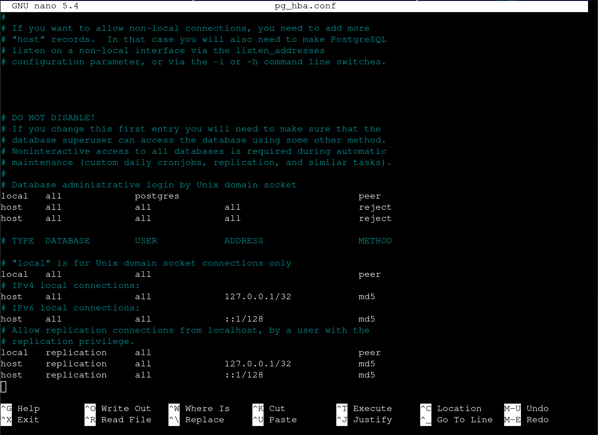

## Description

Une application web utilise une base de données PostgreSQL 13 hébergée sur ce serveur. Cependant, la connexion à la base de données est impossible. Votre tâche consiste à identifier et à résoudre le problème à l'origine de cette défaillance. L'application se connecte à la base de données nommée « app1 » avec l'utilisateur et le mot de passe « app1user ».

---

## Test

```bash
sudo services postgresql status
PGPASSWORD=app1user psql -h 127.0.0.1 -d app1 -U app1user -c '\q'
```

## Error

```bash
psql: error: FATAL:  pg_hba.conf rejects connection for host "127.0.0.1", user "app1user", database "app1", SSL on
FATAL:  pg_hba.conf rejects connection for host "127.0.0.1", user "app1user", database "app1", SSL off
```

## Solution

```bash
cd /etc/postgresql/13/main
ls
sudo nano pg.hba.conf
```

### Contained in pg.hba.conf



### To change

```bash
# Database administrative login by Unix domain socket
local     all     postgres                  peer
host      all     all           all         reject
host      all     all           all         reject
```

### For

```bash
# Database administrative login by Unix domain socket
local     all     postgres                      peer
#host     all     all           all             reject
#host     all     all           all             reject
host      all     app1user      127.0.0.1/32    md5
```

## Explanation

>Le fichier pg_hba.conf bloquait les connexions réseau par sécurité ; j'ai donc désactivé ces règles de rejet et autorisé spécifiquement votre utilisateur app1user à se connecter en local avec son mot de passe.