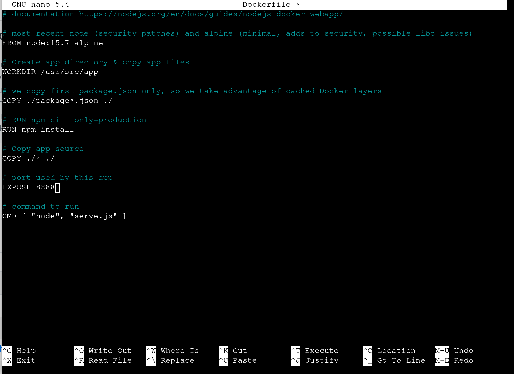

# "Salta": Docker container won't start

**Date** : 18/06/2026
**Difficulté** : moyen

## TL;DR
Arrêt du service Nginx libérant le port 8888, suivi de la correction des erreurs dans le `Dockerfile` (`EXPOSE 8888` et `server.js`) avant de recompiler et lancer le conteneur.

---

## Description

Une application web Node.js conteneurisée se trouve dans le répertoire /home/admin/app. Créez un conteneur Docker pour accéder à l'application web sur le port 8888 et pouvoir y effectuer des requêtes curl. Pour que la solution soit valide, un seul conteneur Docker doit être en cours d'exécution.

---

## Starting

```bash
sudo systemctl status docker
sudo groupadd docker
sudo usermod -aG docker $USER
newgrp docker
docker ps -a
```

## Test Container

```bash
docker restart elated_taussig
```

## Error

```bash
Error response from daemon: Cannot restart container elated_taussig: driver failed programming external connectivity on endpoint elated_taussig (782ac35a9a8c172ba14a5229a3c4924e8f454ec376122a2bcb05e6e1b559f9d6): Error starting userland proxy: listen tcp4 0.0.0.0:8888: bind: address already in use
```

## Test Curl

```bash
curl localhost:8888
```

## Error

```bash
these are not the droids you're looking for
```

## Test port 8888

```bash
sudo ss -tulpn | grep :8888
```

## Returns

```bash
tcp   LISTEN 0      511                            0.0.0.0:8888      0.0.0.0:*    users:(("nginx",pid=620,fd=6),("nginx",pid=619,fd=6),("nginx",pid=618,fd=6))
tcp   LISTEN 0      511                               [::]:8888         [::]:*    users:(("nginx",pid=620,fd=7),("nginx",pid=619,fd=7),("nginx",pid=618,fd=7))
```

## Solution

```bash
cd /home/admin/app
sudo systemctl stop nginx
nano Dockerfile
```

### Contained in Dockerfile



### To change

```bash
# documentation https://nodejs.org/en/docs/guides/nodejs-docker-webapp/

# most recent node (security patches) and alpine (minimal, adds to security, possible libc issues)
FROM node:15.7-alpine

# Create app directory & copy app files
WORKDIR /usr/src/app

# we copy first package.json only, so we take advantage of cached Docker layers
COPY ./package*.json ./

# RUN npm ci --only=production
RUN npm install

# Copy app source
COPY ./* ./

# port used by this app
EXPOSE 8880

# command to run
CMD [ "node", "serve.js" ]
```

### **Error in**

>**EXPOSE 8880**

>**CMD [ "node", "serve.js" ]**

### For

```bash
# documentation https://nodejs.org/en/docs/guides/nodejs-docker-webapp/

# most recent node (security patches) and alpine (minimal, adds to security, possible libc issues)
FROM node:15.7-alpine

# Create app directory & copy app files
WORKDIR /usr/src/app

# we copy first package.json only, so we take advantage of cached Docker layers
COPY ./package*.json ./

# RUN npm ci --only=production
RUN npm install

# Copy app source
COPY ./* ./

# port used by this app
EXPOSE 8888

# command to run
CMD [ "node", "server.js" ]
```

## Finalization

```bash
docker build -t elated_taussig .
sudo docker run -d -p 8888:8888 --name elated_taussig elated_taussig
docker logs elated_taussig
curl localhost:8888
```

## Explanation

>Pour résoudre ce défi, vous devez identifier et arrêter le processus Nginx qui occupe déjà le port 8888, puis lancer votre propre conteneur Docker sur ce même port pour que votre application puisse y répondre. Faut être vigilant sur le Dockerfile aussi, car il y avait des erreurs.