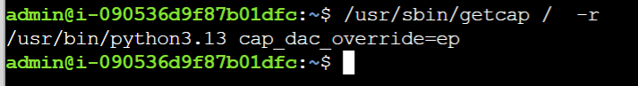
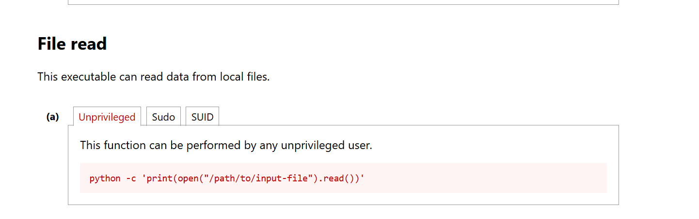

# "Madrid": exploiting capabilities (hard)

Habituellement lors de ce type de challenge on va chercher ce qu'on appelle un **SUID** qui fournirait à un binaire des privilèges trop élevés ce qui nous permettrait d'exécuter ce même programme en tant que root ce qui est dévastateur. 
Pour éviter au mieux ces problèmes Linux a mis en place ce qu'on appelle les **capabilities** qui fonctionnent de la même manière que sur **Docker** si vous  avez l'habitude de cet outil.

Vous pouvez regarder [Linux Capabilities and PrivEsc | ElnurBDa](https://elnurbda.com/posts/05-linux-capabilities-privesc/) si vous souhaitez mieux comprendre.

la commande `getcap / -r` : permet de regarder si des fichiers depuis la racine en mode récursif (c-à-d qu'il va aller voir dans tous les dossiers du système) auraient des capabilities mal configurées.

On comprend que le binaire Python3.13 a le droit **cap_dac_override** (bypass discretionary access control) ce qui signifie pour nous qu'il peut lire, écrire et exécuter n'importe quel fichier, ce qui est exactement ce que l'on cherche sachant que nous souhaitons lire le fichier /root/flag.txt.

On se rend sur [python | GTFOBins](https://gtfobins.org/gtfobins/python/) qui est une plateforme qui permet de voir les possibilités de privesc avec différents binaires.

La commande qui nous intéresse vraiment est la suivante : 

Nous utiliserons la commande suivante car nous n'avons aucun privilège sur la machine `python3.13 -c 'print(open("/root/flag.txt").read())'`.

Bingo on obtient le flag!!

==SadServer{CAPABILITIES_ARE_HIDDEN_GEMS}==

Finalement ce challenge est assez simple, il ne demande pas beaucoup de réflexion mais reste intéressant car il permet d'introduire à la notion de capabilities que je ne connaissais pas encore sur Linux. 