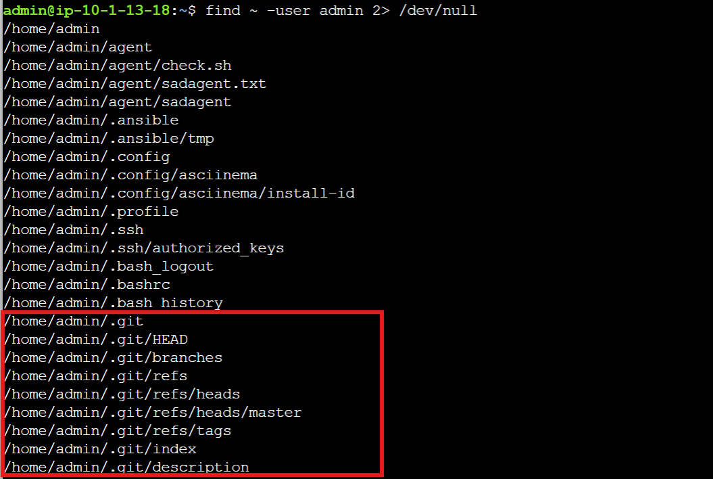
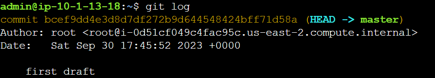
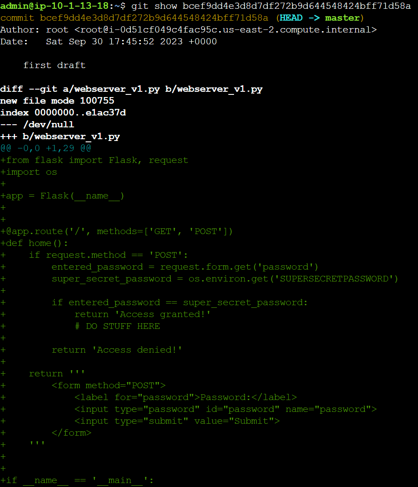
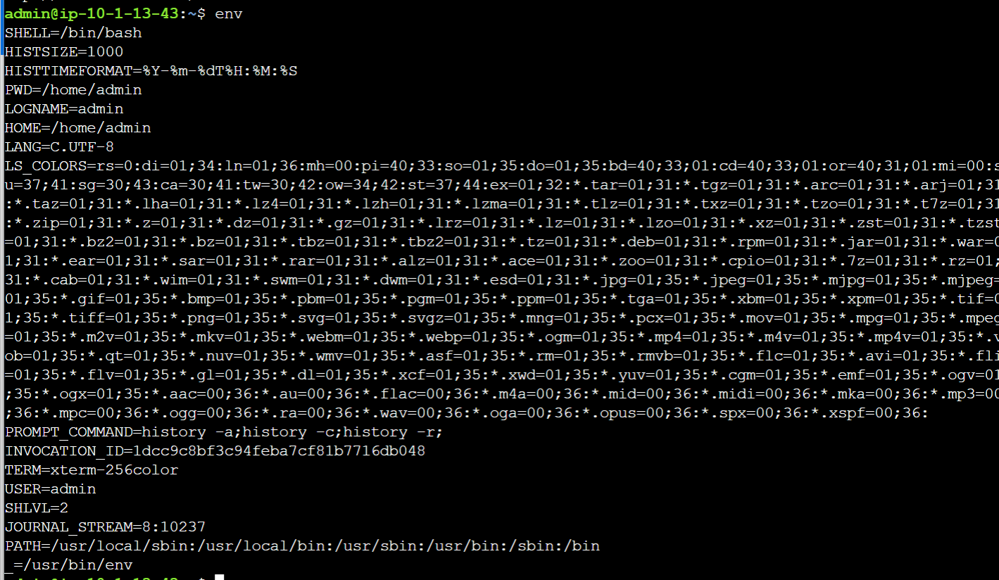
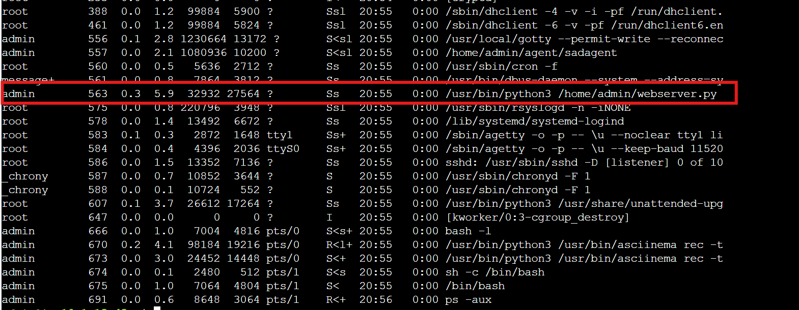
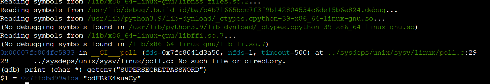
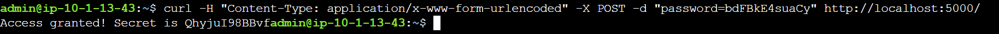

# "Monaco": Disappearing Trick (Hard)

Ce challenge porte sur les notions de web et système. 
Nous avons une application qui tourne sur le port 5000 qui a une route en POST qui attend un mot de passe et va nous renvoyer le vrai mot de passe. On ne sait pas encore le format de la requête mais on va l'apprendre lors du défi.

Première étape évidente on cherche à savoir le format de la requête donc on cherche un code, on nous indique que le développeur à développé avec le compte admin donc on peut utiliser la commande find pour chercher les fichiers qui appartiennent à notre utilisateur courant.

`find ~ -user admin 2> /dev/null`

On aperçoit un dossier **.git**, l'utilisateur a donc peut être fait des commit, c'est un pivot assez courant en cyber.

On utilise la commande : **git log** afin d'afficher la liste des commit

On voit un commit **bcef9dd4e3d8d7df272b9d644548424bff71d58a** puis on affiche le contenu de celui-ci avec la commande `git show bcef9dd4e3d8d7df272b9d644548424bff71d58a`

Nous sommes donc sur un un serveur Flask, un serveur web Python avec une route en GET qui retourne simplement le formulaire HTML et en POST qui attend un mot de passe "password" 

La commande suivante est celle qui nous permet d'envoyer le mot de passe  à l'application :

`curl -H "Content-Type: application/x-www-form-urlencoded" -X POST -d "password=1234" [http://localhost:5000/](http://localhost:5000/ "http://localhost:5000/")`

En lisant le code on voit que le mot de passe se trouve dans les variables d'environnements.

On utilise donc la commande **env**.

Comme on s'en doutait le mot de passe n'est pas ici. On va donc chercher la variable d'environnement à la source, directement dans le processus.

La commande `ps -aux` nous donne le résultat suivant.

Le processus est le **563**, on va utiliser **GDB** qui est un debugger et permet de lire des informations directement dans un processus.
On utilise la commande **print (char *) getenv("SUPERSECRETPASSWORD")**

Le mot de passe est le suivant :  **"bdFBkE4suaCy"**
On utilise la commande CURL suivante : 

`curl -H "Content-Type: application/x-www-form-urlencoded" -X POST -d "password=bdFBkE4suaCy" http://localhost:5000/`

Le flag est donc: **QhyjuI98BBvf**