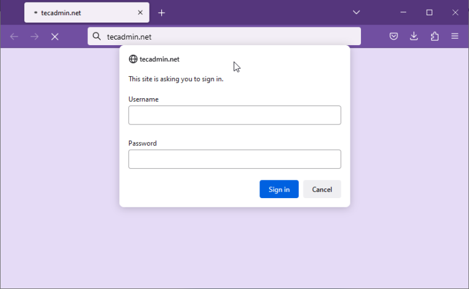
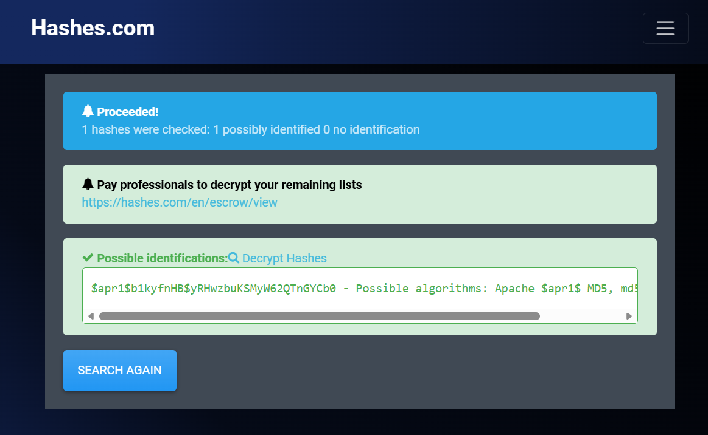
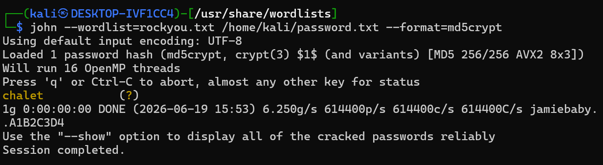
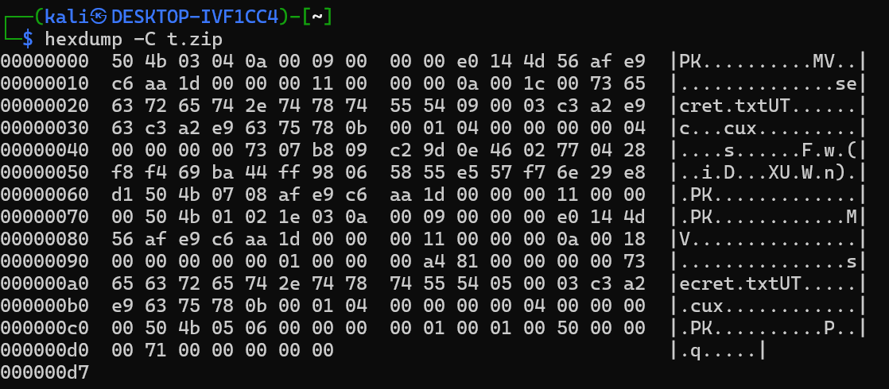
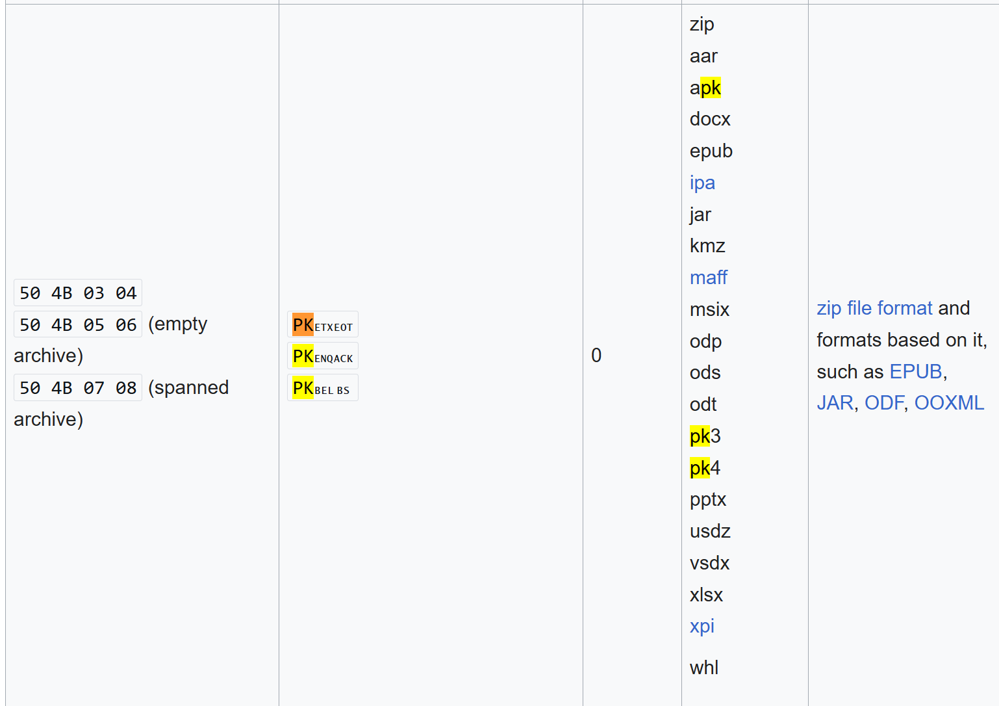

# Roseau: Hack a Web Server
## Contexte

Nous nous trouvons sur une serveur qui héberge une application web avec le serveur web Apache. L'objectif n'est pas différent de d'habitude, il s'agit de trouver le fichier "secret.txt". La consigne indique que nous avons accès aux outils Hashcat, John The Ripper et Hydra qui sont des outils de bruteforce et plus specifiquement de mot de passe pour ce qui est du cas de Hashcat et John The Ripper car Hydra permet de faire beaucoup plus de chose.

## Etape 1
Si je détaille plus haut à quoi servent ces otuils c'est que c'est qu'ils indiquent où se rendre ensuite. Dans Apache il existe un fichier qui s'appelle ".htpasswd" qui permet de gerer une authentification pour les pages web. https://httpd.apache.org/docs/current/programs/htpasswd.html


Bingo!! Le fichier est bien lisible par l'utilisateur courant. On voit donc le nom de l'utilisations ainsi qu'un hash de son mot de passe: `$apr1$b1kyfnHB$yRHwzbuKSMyW62QTnGYCb0`.
En se rendant sur l'application https://hashes.com/en/tools/hash_identifier.



On voit que cela correspond à un mot de passe de type apr1. C'est un hash utilisé par Apache qui utilise md5, 1000 fois. MD5 est depassé depuis quelques années maintenant, répeter l'opération 1000 fois ne le rend pas spécialement plus sécurisé ;) surtout avec la puissance de calcul qu'on a aujourdui c'est d'ailleurs un algorithme qui date de 1994 à la base crée pour FreeBSD.

On a le salt définit entre `$b1kyfnHB$` en fait un salt permet d'eviter que lorsqu'un mot de passe soit compromis on puisse utiliser une rainbow table ou meme de faire notre propre rainbow table dans le cas où on aurait plusieurs mot de passes, car chaque mot de passe utilise un salt différent.

On peut utiliser John The ripper avec la commande suivante:
```john --wordlist=rockyou.txt /home/kali/password.txt --format=md5crypt```



## Etape 2

En faisant une requete sur localhost à l'aide de la commande ```curl -u username:chalet localhost```, on tombe sur une page qui a comme lien un page nommé "webfiles". En faisant une requete sur cette page avec Curl cela nous indique que du binaire y est retourné. Quand on a du binaire mais qu'on ne sait pas ce que c'est, on peut utiliser la signature de ce meme binaire. On utilise la commande hexdump qui renvoit en hexadecimal la signature.


Ensuite on cherche sur la page suivante :
https://en.wikipedia.org/wiki/List_of_file_signatures.


On trouve donc que nous avons affaire à un fichier ".zip". On doit maintenant le télécharger comme tel. Pour deziper un zip sur linux on a un binaire qui s'appelle unzip.

A ce moment on pense avoir toucher le bout mais ce zip est proteger par un mot de passe. Sur Kali Linux il existe un outil qui s'appelle fcrackzip qui permet de faire cela.

La commande suivante sudo `crackzip -u -D -p /usr/share/wordlists/rockyou.txt t.zip` on trouve finalement que le mot de passe est "andes" ou peut etre que c'est une collision. C'est à dire un mot de passe qui permet de déchiffrer mais qui n'est pas le mot de passe original si un algorithme est mal codé il se peut que plusieurs mot de passe permettent d'arriver au résultat final.

"secret.txt" contient donc "Roseau, Dominica"

---
